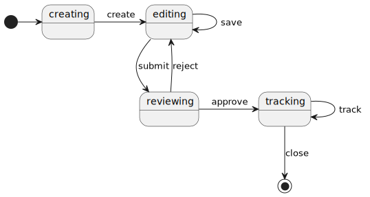
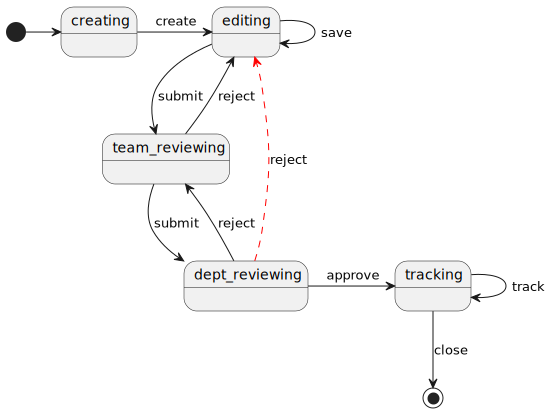
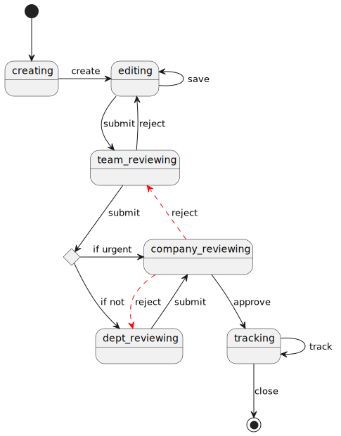
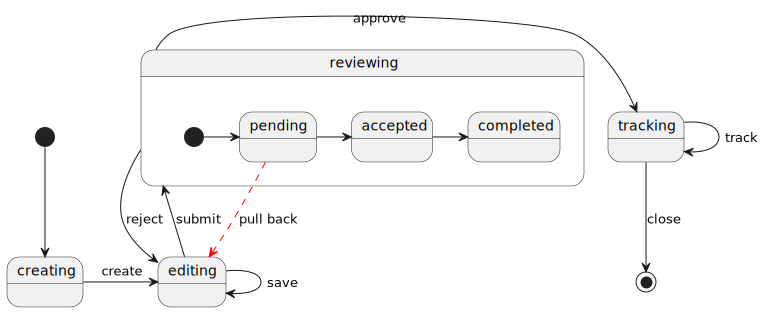

# manteau-flow

## About

Manteau-flow is a simple business flow engine which is built on state charts implementation from apache (commons-scxml).

## Why manteau-flow

### State machine based business process modeling

A business flow is a set of states with transitions between them. Each state represents a status where some action might
have to be performed. Each state contains a set of transitions that define how it reacts to events. Events can be
generated by the state machine itself or by external entities. In a traditional state machine, the machine is always in
a single state. This state is called the active state. When an event occurs, the state machine checks the transitions
that are defined in the active state. If it finds one that matches the event, it moves from the active state to the
state specified by the transition. Thus, the target state becomes the new active state.

For instance, there could be a business flow for submitting a bid.

Right after the starting of the flow, a bid object should be **created**. Then users can **save** temporary content
repeatedly until they submit the bid to some manager for reviewing. The manager can choose to **approve** or **reject**
for
editing again or tell other users to keep **tracking** the progress of the bid.

The [standard state machine notion](https://www.w3.org/TR/scxml/) can be used to model such scenario conveniently and
apache [commons-scxml](https://commons.apache.org/proper/commons-scxml/) implements such state machine engine fully.

### Flexible process modeling

However, in some business situation, the flow needs to be more flexible. For example, the reviewing steps could be
hierarchical (a team scope reviewing followed by a department scope one). If the department reviewer is not happy with
the bid content, he can decide to return the bid to team reviewer or directly to the editor, shown as the red arrow.
Further, if the editor makes revision on the bid according to a reject opinion from some department reviewer, he might
have options to submit to the team reviewer again following the original reviewing flow, or he could directly submit to
the department reviewer.

Adding this possible transition into the state machine model is a solution. However, some domestic organization might
have a considerable tall hierarchy of management which usually results in very long reviewing chains. Modeling all those
possible transitions makes the model itself messy. In addition, whether these transitions can happen is constrained
business rules. For example, if team reviewer can choose to submit to department or company for reviewing according to
the urgency of the bid, as shown in the following figure. So when company reviewer wants to reject, he has to check the
origin of the bid in-hand. Returning an urgent bid to department reviewer, who has no idea of the bid in process, makes
no sense.

### GOTO semantics for state transition

The flexibility needed in these business scenarios concludes as a *GOTO* mechanism where the state can transition to
another beyond the machine's basic structure. In the original semantics of the machine execution, when a normal event
occurs, if there is a transition match the event it moves from the active state to the state specified by the
transition. The *GOTO* mechanism introduces a special kind of event, say event whose name starts with "_GOTO_" with a
payload of a state identification (this is just one possible implementation). On any GOTO event, the state machine jump
to the destination state identified by the event.

#### Trace based dynamic transition

This GOTO mechanism virtually equals to adding/removing transitions into the model on-the-fly. Of course the rationality
of runtime transitions (which transition can be added or removed) needs to be specified in business models as well. In
the aforementioned *flexible* processes, the valid states where a reviewing process can go back is those that exist in
the execution trace of the machine. Formally balabala (needs a formal definition of such business rules here).

Therefore, the execution engine for state machines needs to record execution trace for each machine instance. Each node
in the trace contains the identification of the corresponding state as well as other information about the
entering of the state, including timestamp and other context variables. As each state can be entered multiple times, a
unique identification of that entering should be one of the context variables so that the trace can be constructed
correctly when more than one state become active simultaneously.

##### State Pull-back

Business rules for GOTO can be extended as needed. For example, some scenario might allow a state be *pulled back* even
a transition to the next state has already finished (the current active state is its following state) as long as the
task for
the current state is not started (in a sense of business) yet. Handling this rule need to modeling the lifecycle of a
task for some state in a finer level.

Building a runtime transition and triggering a *GOTO* thus takes the internal lifecycle state of the current active
state into account.

#### Organizational-structure-driven workflow

Common business flows are approval workflows. Such workflows always mirror the organizational structure. Their
definitions thus can be abstract. For example, the term of *two-level approval* implies an approval workflow that goes
from a low level manager to a high one. The corresponding state set can be inferred with the structure of the
organization and GOTO transitions can be validated against the structure.