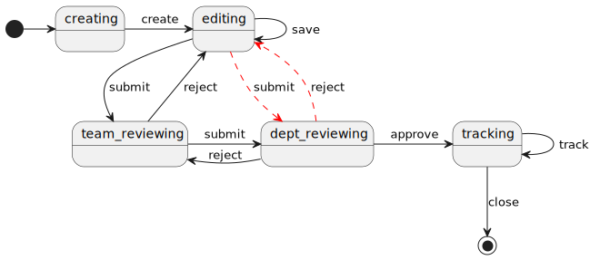

# manteau-flow

Manteau-flow is a simple business flow engine which is built on state charts implementation from apache (scxml).

A business flow is a set of states with transitions between them. Each state represents a status where some action might
have to be performed.

For instance, there could be a business flow for submitting a bid.

Right after the starting of the flow, a bid object should be **created**. Then users can **save** temporary content
repeatedly until they submit the bid to some manager for reviewing. The manager can choose to **approve** or **reject**
for
editing again or tell other users to keep **tracking** the progress of the bid.

The [standard state machine notion](https://www.w3.org/TR/scxml/) can be used to model such scenario conveniently and
apache [commons-scxml](https://commons.apache.org/proper/commons-scxml/) implements such state machine engine fully.
However in some business situation, the flow needs to be more flexible. For example, the reviewing steps could be
hierarchical (a team scope reviewing followed by a department scope one). If the department reviewer is not happy with
the bid content, he can decide to return the bid to team reviewer or directly to the editor, shown as the red arrow.
Further, if the editor makes revision on the bid according to a reject opinion from some department reviewer, he might
have options to submit to the team reviewer again following the original reviewing flow, or he could directly submit to
the department reviewer.

Adding this possible transition into the state machine model is a solution. However, some domestic organization might
have a considerable tall hierarchy of management which usually results in very long reviewing chains. Modeling all those
possible transitions makes the model itself messy. In addition, whether these transitions can happen is constrained
business rules.

